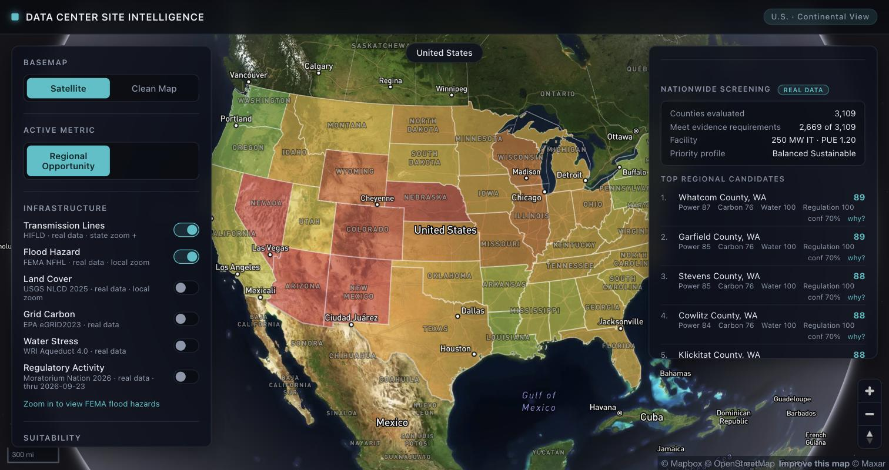
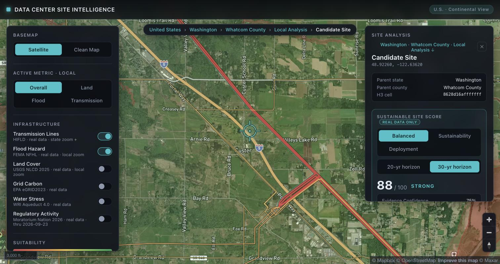

# Data Center Site Intelligence

A geospatial decision-support tool for screening sustainable U.S. data-center locations. You describe the facility you want to build (IT capacity, PUE, WUE, planning horizon), the app scores all 3,109 contiguous-U.S. counties against real federal and institutional datasets, and when you zoom in and drop a pin it screens that exact coordinate with flood, land-cover and hard-exclusion checks added. Built with React 19, TypeScript, Vite, Mapbox GL, deck.gl and Zustand.



## What it does

The workflow runs from national to parcel scale:

1. Configure the facility on the left panel (100/250/500 MW IT, PUE, WUE, 20 or 30 year horizon, decision profile).
2. The right panel ranks counties by a Regional Opportunity Score computed for that facility. Changing the facility or profile recomputes the ranking in memory, in about 30 ms, with no refetching.
3. Click a candidate to zoom in, then click the map to place an exact coordinate.
4. The pin gets a coordinate-level sustainability screen: live FEMA flood and USGS land-cover lookups, hard exclusions, five scored pillars, deterministic "why it ranks" and "key risks" lists, and the facility's simulated electricity, carbon and water demand.



Under the default configuration (250 MW, PUE 1.20, WUE 0.34, 30-year horizon, Balanced profile) the top-ranked county is Whatcom County, WA. That is an output of the engine, not a hardcoded result; at 100 MW the ranking reorders.

## How scoring works

All formulas live in `src/lib/decisionEngine.ts` (exact site) and `src/lib/regionalScreening.ts` (nationwide), with the facility math in `src/lib/simulation.ts`. The steps:

1. Raw evidence is normalized into 0 to 100 utility scores. Examples: transmission utility combines line distance with voltage adequacy for the configured facility load, carbon utility is the percentile of the site's eGRID rate within the fixed national subregion distribution, water utility is `100 - aqueductScore * 20` weighted across baseline/2030/2050 by the planning horizon.
2. Utilities group into pillars: Power & Grid Readiness, Grid Carbon, Water Sustainability, Physical Site & Resilience (exact site only), Community & Regulation.
3. The selected decision profile sets pillar weights. Balanced is 30/20/20/15/15; Sustainability First and Deployment First shift them.
4. Pillars combine with a weighted geometric mean, so one very weak pillar drags the total instead of being averaged away. A Phoenix-area test point scores 83 on power and 100 on regulation but 32 overall because its water pillar is near zero.
5. At the exact coordinate, hard constraints run before any scoring: NLCD open water, wetlands or perennial ice, and FEMA regulatory floodway or V/VE coastal zones mark the point EXCLUDED with the reason shown.

Missing evidence is never scored as zero. The affected pillar renormalizes over what is available, and a separate evidence-confidence percentage (a fixed rubric in `decisionEngine.ts`) drops instead. Counties missing carbon, water, transmission or state grid evidence, or under 65% confidence, keep their map score but are excluded from the Top Regional Candidates list.

Regional scoring deliberately omits the Physical pillar because flood and land cover vary too much within a county; those only apply once you have a coordinate. Each county is evaluated at a representative interior point, precomputed by `npm run prepare:regional` into `public/data/decision/regional_evidence.json`.

The map's state shading is the median of that state's county scores, so a state can look weak while containing strong counties (Utah's median is 67 but Emery County scores 87). The state panel shows both numbers.

## Facility-aware ranking

Facility settings change how a location performs. Decision profiles change how much each pillar matters. Concretely:

- IT capacity and PUE set the facility load, which feeds the voltage-adequacy check (a 230 kV line is fine at 300 MW load, below preference at 600 MW) and the facility's share of state retail electricity sales. Larger facilities can reorder the rankings.
- Planning horizon shifts the Aqueduct weighting between baseline, 2030 and 2050 stress.
- WUE changes the simulated water consumption only. It does not change rankings, because the system has no defensible basin-capacity denominator to score absolute water demand against, and faking one would be worse than omitting it. The UI says this.

## Data sources

Every number in the scoring comes from one of these. The old prototype suitability scores (state/county Power, Water, Buildability and the H3 drill-down cells) are synthetic leftovers, labeled Mock/Demo in the UI, and feed nothing.

| Source | Used for | Resolution / caveat |
| --- | --- | --- |
| [HIFLD Electric Power Transmission Lines](https://catalog.data.gov/dataset/electric-power-transmission-lines) | Nearest-line distance and voltage | Proximity does not equal available interconnection capacity |
| [NERC 2026 Summer Reliability Assessment](https://www.nerc.com/globalassets/our-work/assessments/nerc_sra_2026.pdf) | Reserve margins, seasonal risk | Assessment-area level; 12 states split across areas are reported as unavailable rather than guessed |
| [EPA eGRID2023 Rev. 2](https://www.epa.gov/egrid/summary-data) | Grid carbon intensity (total output CO2e rate, field SRC2ERTA) | Subregion average, not the serving utility |
| [WRI Aqueduct 4.0](https://www.wri.org/data/aqueduct-global-maps-40-data) | Water stress, baseline/2030/2050 | Basin-level screening; does not measure project-specific available water. CC BY 4.0 |
| [FEMA National Flood Hazard Layer](https://hazards.fema.gov/) | Flood zones, hard exclusions | Queried live per coordinate; unmapped areas report unknown, not safe |
| [USGS Annual NLCD 2025](https://www.usgs.gov/data/annual-national-land-cover-database-nlcd-collection-1-products-ver-12-june-2026) | Land cover, hard exclusions | 30 m pixel, queried live; says nothing about ownership or zoning |
| EIA-style state generation and sales (`data-sources/`) | Demand growth, generation balance, facility burden | State-level annual energy; generation minus sales is an accounting figure, not spare capacity |
| [Moratorium Nation 2026](https://github.com/mjbommar/moratorium-data-2026) | Local moratoria, state policy | Jurisdiction centroids, snapshot through 2026-09-23; proximity does not prove legal applicability, and the data does not measure general community sentiment. CC BY 4.0, Bommarito (2026) |

Methodology references for the simulator: the [DOE data-center best practices guide](https://www.energy.gov/sites/default/files/2024-07/best-practice-guide-data-center-design_0.pdf) for PUE reference points and [Microsoft's PUE/WUE page](https://datacenters.microsoft.com/sustainability/efficiency/) for the WUE definition and the 0.27/0.34 L/kWh presets (benchmarks, not site measurements).

All datasets except FEMA and NLCD are preprocessed by the scripts in `scripts/` and committed under `public/data/` (about 84 MB), so a fresh clone needs no downloads or API keys beyond a Mapbox token.

## Run locally

Requires Node 22+ (the test scripts use `node --experimental-strip-types`).

```bash
git clone https://github.com/ABthesomewhatcoder/datacenter-bac-hackathon.git
cd datacenter-bac-hackathon
npm install
cp .env.example .env   # then set VITE_MAPBOX_TOKEN (free at account.mapbox.com)
npm run dev
```

FEMA and NLCD lookups hit free public government APIs at runtime, no keys needed.

## Scripts and tests

```bash
npm run build          # tsc + vite production build
npm run lint           # oxlint
npm run test:sim       # facility simulator formulas (verifies the 250 MW / PUE 1.20 acceptance numbers)
npm run test:decision  # exact-site engine: utilities, hard exclusions, geometric mean, confidence
npm run test:regional  # nationwide screening against the real precomputed evidence; prints the Top 20
npm run test:reg       # regulatory distance bands and activity indicator
npm run test:grid      # grid-context classifiers and facility burden
npm run prepare:regional  # regenerate county evidence (about 20 s, only needed after data changes)
```

The tests are plain Node scripts with `assert`, no test framework.

## Project structure

```
src/lib/          scoring engines and data access (decisionEngine, regionalScreening,
                  simulation, gridContext, egrid, aqueduct, flood, landCover,
                  transmission, regulatory)
src/components/   map layers, panels (facility profile, national screening,
                  exact-site score card), layout
src/store/        single Zustand store; facility changes trigger the regional recompute
scripts/          dataset preprocessing and tests
public/data/      committed preprocessed datasets
data-sources/     raw inputs for the grid-context preprocessing
docs/screenshots/ README images
```

## Limitations

This is early-stage screening, not site approval. A high score means "strong candidate for deeper due diligence," nothing more. Specifically:

- Parcel acreage, ownership, zoning, fiber, permitting, geotechnical conditions and actual utility interconnection are out of scope.
- Transmission data is a 2023 HIFLD snapshot and NERC margins are seasonal planning figures, neither is a capacity study.
- Regional scores use one representative point per county; conditions vary inside counties, which is exactly why the exact-site screen re-checks flood and land cover.
- Alaska and Hawaii are excluded from regional screening (no transmission extracts, outside NERC SRA areas).
- Moratorium records are current through September 23, 2026 and regulatory facts change quickly.
- The H3 local cells and the state/county Power/Water/Buildability bars are prototype navigation visuals with synthetic values. They are labeled as such and never enter any real score.
